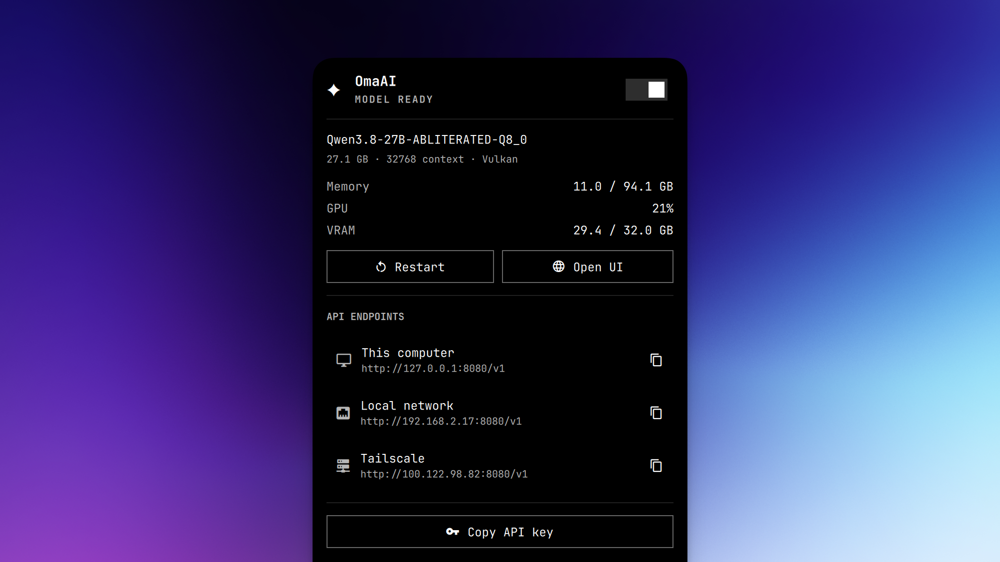

<p align="center">
  
</p>

<h1 align="center">OmaAI</h1>

<p align="center">A small Omarchy menu-bar controller for an existing llama.cpp model.</p>

## Install

Install llama.cpp and download a GGUF model first. Then:

```bash
git clone https://github.com/Aayush9029/OmaAI.git
cd OmaAI
./install.sh ~/Models/your-model.gguf
```

That is all. OmaAI does not install llama.cpp, download a model, install Docker, or modify your firewall.

## Use it

```bash
omaai status
omaai start|stop|restart
```

The Omarchy sparkle opens a panel with load/unload, restart, web UI, endpoint copying, API-key copying, RAM use, GPU load, and VRAM use.

The OpenAI-compatible API uses:

```text
Base URL: http://127.0.0.1:8080/v1
Model:    omaai
API key:  ~/.config/omaai/api-key
```

## What gets installed

```text
~/.local/bin/omaai*                       controller and launcher
~/.config/systemd/user/omaai.service      llama.cpp user service
~/.config/omarchy/plugins/local.omaai/    menu-bar plugin
~/.config/omaai/                          model path, private API key and settings
```

The model server starts automatically when you log in. Load and unload it from the panel, or use `omaai start` and `omaai stop`.

## Hardware profile

The launcher uses full GPU offload, Flash Attention, and one 32K-context slot. It is tested on a Framework Desktop Ryzen AI Max+ 395 / Radeon 8060S, but works with any llama.cpp-supported GPU.

## Sources

- [llama.cpp](https://github.com/ggml-org/llama.cpp)

OmaAI does not redistribute or download model weights.
